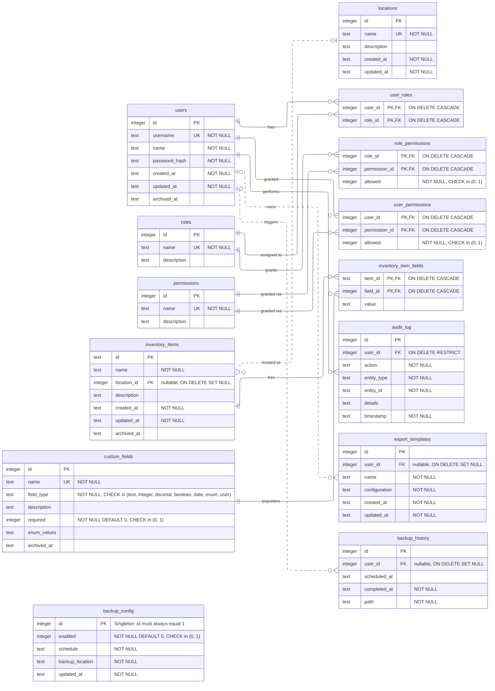

# Database Schema

This diagram is generated from [`schema.dbml`](./schema.dbml), which is the
source of truth for the database schema. The executable schema lives at
[`database/schema.sql`](../../database/schema.sql).

Notes:

- Dashed lines (`..`) indicate optional (nullable) foreign keys.
- `backup_config` is a singleton table: `id` must always equal `1`.
- `check` constraints and `on delete` actions shown in quotes are enforced in
  `database/schema.sql`.
